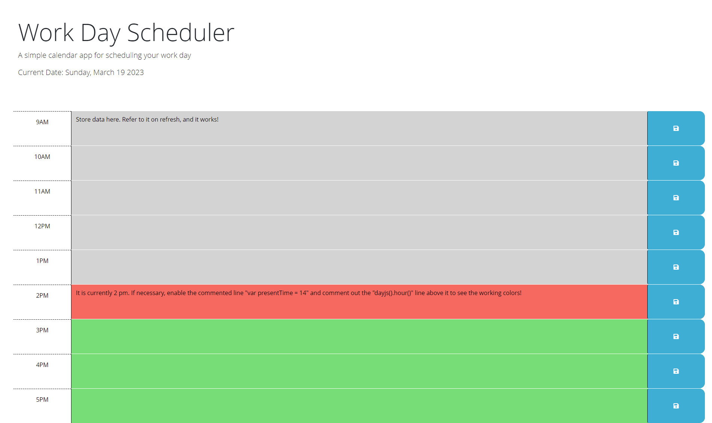

# Refactoring a Scheduler

## Description
This is the refactored code for a daily planning scheduler. Inside, a user can keep track of their daily tasks or upcoming events within standard business hours.

## Usage
Access the page using [this link!](https://austinl96.github.io/refactoring_a_scheduler/)

Once you're there, you'll notice the blocks for each hour change according to the current time. At the top of the page the current day, month, day of the month, and year will be visible.

A past hour will be marked grey, the present hour is red, and future hours are green!

Knowing that, start planning away! Click the empty text boxes and type out your upcoming tasks before clicking the light-blue save buttons on the right. Doing so will save what you wrote, so even if you leave the page it should stay the next time you look at your planner! Delete your text and click save if you need to erase anything.

Here is an example of what the page will look like for you:

## License
N/A
